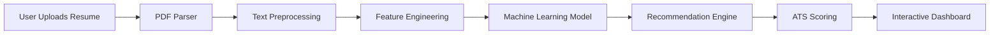
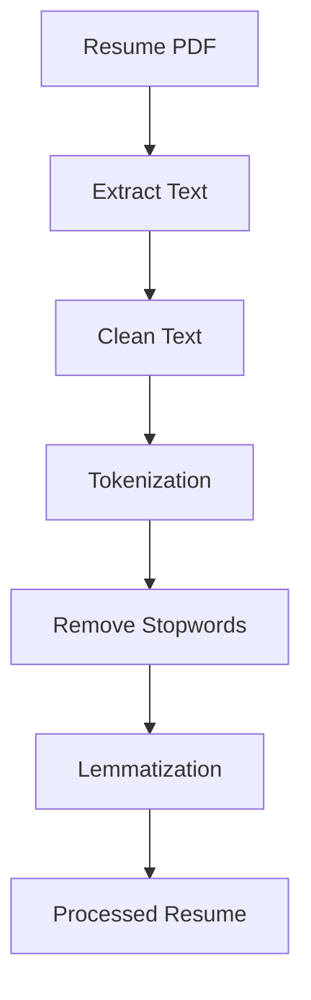
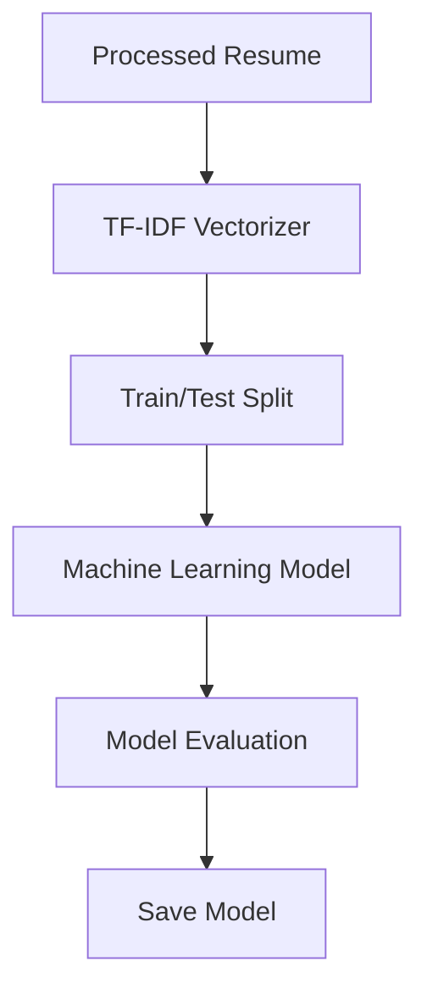
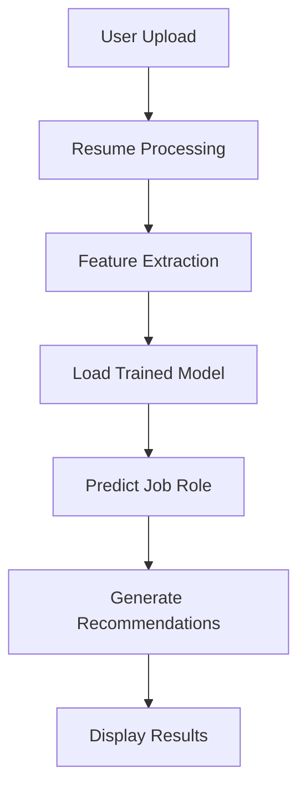

# 🏗️ CareerLens AI - System Architecture

**Version:** 1.0

---

# 📖 Overview

CareerLens AI follows a modular architecture where each component has a single responsibility.

The system receives a resume, processes it, extracts meaningful information, predicts a suitable job role, generates recommendations, and presents the results through an interactive dashboard.

---

# 🏛 High-Level Architecture



---

# 📄 Resume Processing Pipeline



---

# 🧠 Machine Learning Pipeline



---

# 📊 Prediction Pipeline



---

# 🖥️ Application Architecture

```mermaid
flowchart LR

User

--> Streamlit

Streamlit

--> Resume Parser

Resume Parser

--> NLP Pipeline

NLP Pipeline

--> Machine Learning Model

Machine Learning Model

--> Recommendation Engine

Recommendation Engine

--> Dashboard
```

---

# 📂 Project Structure

```text
CareerLens AI

│

├── app/

├── assets/

├── configs/

├── datasets/

├── docs/

├── models/

├── notebooks/

├── reports/

├── src/

│   ├── data/

│   ├── features/

│   ├── models/

│   ├── pipeline/

│   ├── utils/

│   ├── preprocess.py

│   ├── train.py

│   └── predict.py

├── tests/

└── README.md
```

---

# 🔄 Data Flow

1. User uploads a resume.
2. PDF parser extracts the text.
3. NLP preprocessing cleans the text.
4. Features are generated using TF-IDF.
5. The trained model predicts a suitable job role.
6. The recommendation engine generates insights.
7. ATS score is calculated.
8. Results are displayed through the Streamlit dashboard.

---

# 🔮 Future Architecture

Future versions will expand the architecture with additional AI capabilities.

```mermaid
flowchart LR

Resume

--> NLP

NLP

--> ML

ML

--> LLM

LLM

--> RAG

RAG

--> AI Agent

AI Agent

--> Career Coach Dashboard
```

---

# 🎯 Design Principles

CareerLens AI follows these engineering principles:

- Modular architecture
- Separation of concerns
- Reusable components
- Scalable design
- Clean code
- Easy testing
- Easy deployment
- Incremental feature development

---

# 🚀 Long-Term Vision

The architecture is intentionally designed to support future upgrades without major restructuring.

As new AI technologies are learned throughout the AI Engineer Journey, new modules will be integrated into the existing pipeline rather than replacing the entire system.